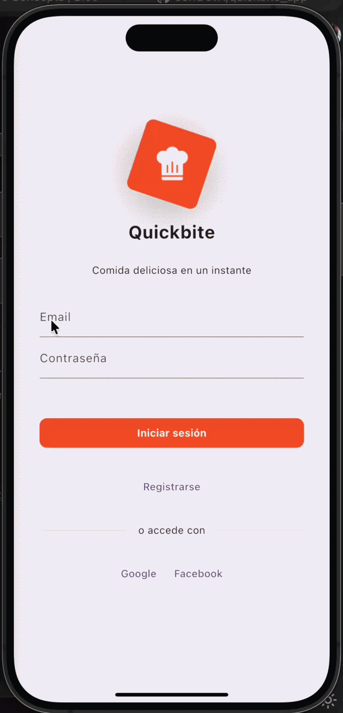

# QuickBite App


<p align="center">
  
  
</p>

Una aplicación móvil para realizar pedidos de comida directamente en el restaurante, desarrollada en Flutter con arquitectura BLoC, Firebase backend y autenticación de usuarios. El proyecto implementa principios modernos de desarrollo cloud-native, sincronización en tiempo real y microservicios mediante Cloud Functions.

---

# 🚀 Características

- 🍔 Menú interactivo con categorías dinámicas
- 👤 Autenticación de usuarios mediante Firebase Authentication
- 🛒 Carrito de compras en tiempo real
- 📱 Dashboard administrativo
- 🔥 Sincronización en tiempo real con Firestore
- ☁️ Arquitectura serverless basada en Cloud Functions
- 📊 Observabilidad mediante Firebase Crashlytics
- 🔐 Seguridad mediante Firebase Security Rules
- 🎨 UI/UX moderna usando Material Design
- 📦 Escalabilidad automática cloud-native

---

# 🏗️ Arquitectura del Sistema

QuickBite implementa una arquitectura distribuida basada en tecnologías Firebase y Google Cloud.

## Componentes principales

### Frontend

- Flutter
- Dart
- Material Design

### Backend Serverless

- Firebase Cloud Functions
- Cloud Firestore
- Firebase Authentication
- Firebase Hosting

### Observabilidad y Monitoreo

- Firebase Crashlytics
- Cloud Logging
- Cloud Monitoring

### Comunicación

- Arquitectura basada en eventos
- Sincronización en tiempo real
- Microservicios desacoplados

---

# 📱 Screenshots

_(Agregar capturas reales de la aplicación aquí)_

---

# 🛠️ Stack Tecnológico

## Frontend

- **Flutter** — Framework multiplataforma
- **Dart** — Lenguaje de programación
- **Material Design** — Sistema de diseño UI

## Arquitectura

- **BLoC Pattern** — Gestión de estado
- **GoRouter** — Navegación declarativa
- **Repository Pattern** — Separación de responsabilidades
- **Arquitectura Serverless** — Backend desacoplado

## Backend & Servicios Cloud

- **Firebase Authentication** — Gestión de usuarios
- **Cloud Firestore** — Base de datos NoSQL en tiempo real
- **Cloud Functions** — Microservicios serverless
- **Firebase Hosting** — Hosting web
- **Firebase Crashlytics** — Reporte y monitoreo de errores
- **Cloud Logging** — Registro de eventos
- **Cloud Monitoring** — Métricas y monitoreo

---

# 📁 Estructura del Proyecto

```plaintext
lib/
├── core/                    # Configuración global y utilidades
│   └── repositories/       # Repositorios principales
├── features/               # Módulos de funcionalidades
│   ├── cart/              # Carrito de compras
│   │   ├── bloc/
│   │   ├── models/
│   │   ├── repositories/
│   │   └── screens/
│   ├── dashboard/         # Panel administrativo
│   │   ├── orders_bloc/
│   │   └── screens/
│   ├── home/              # Pantalla principal
│   │   ├── bloc/
│   │   ├── models/
│   │   ├── repository/
│   │   ├── screens/
│   │   └── widgets/
│   ├── login/             # Autenticación
│   │   ├── auth/bloc/
│   │   ├── bloc/
│   │   └── screens/
│   └── register/          # Registro de usuarios
│       ├── bloc/
│       └── screens/
├── routes/                # Configuración de rutas
├── firebase_options.dart  # Configuración Firebase
└── main.dart             # Punto de entrada
```

---

# 🔥 Integración con Firebase

QuickBite utiliza Firebase como plataforma principal para la infraestructura cloud del sistema.

## Firebase Authentication

Se utiliza para:

- Registro de usuarios
- Inicio de sesión
- Gestión de sesiones
- Validación de credenciales
- Control de acceso basado en roles

---

## Cloud Firestore

Cloud Firestore actúa como la base de datos principal del sistema.

Se utiliza para:

- Gestión de productos
- Persistencia de pedidos
- Sincronización en tiempo real
- Actualización automática de estados
- Gestión de usuarios y roles

---

## Cloud Functions

Las Cloud Functions implementan la lógica backend desacoplada mediante microservicios serverless.

Responsabilidades:

- Procesamiento de pedidos
- Validación de datos
- Automatización de eventos
- Ejecución de lógica de negocio
- Integración entre servicios

---

## Firebase Hosting

Utilizado para:

- Despliegue de la aplicación Flutter Web
- Distribución mediante CDN
- Escalabilidad automática

---

## Firebase Crashlytics

Crashlytics permite:

- Captura automática de errores
- Monitoreo de fallos críticos
- Diagnóstico de excepciones
- Observabilidad del sistema
- Análisis de estabilidad de la aplicación

---

# 🚀 Instalación

## Prerrequisitos

- Flutter SDK 3.7.2 o superior
- Dart SDK
- Android Studio / VSCode / Xcode
- Firebase CLI
- Proyecto Firebase configurado

---

# 📥 Clonar repositorio

```bash
git clone <repository-url>
cd quickbite_app
```

---

# 📦 Instalar dependencias

```bash
flutter pub get
```

---

# 🔥 Configurar Firebase

## 1. Crear proyecto Firebase

Desde:

- Firebase Console
- Google Cloud Console

---

## 2. Configurar aplicaciones

Agregar:

- Android
- iOS
- Web

---

## 3. Descargar archivos de configuración

### Android

```plaintext
google-services.json
```

Ubicar en:

```plaintext
android/app/
```

---

### iOS

```plaintext
GoogleService-Info.plist
```

Ubicar en:

```plaintext
ios/Runner/
```

---

# 🔧 Habilitar servicios Firebase

Activar:

- Firebase Authentication
- Cloud Firestore
- Cloud Functions
- Firebase Hosting
- Firebase Crashlytics

---

# 🔐 Firestore Security Rules

```javascript
rules_version = '2';

service cloud.firestore {
  match /databases/{database}/documents {

    match /products/{document} {
      allow read: if true;
      allow write: if request.auth != null;
    }

    match /orders/{document} {
      allow read, write: if request.auth != null;
    }
  }
}
```

---

# ▶️ Ejecutar aplicación

```bash
flutter run
```

---

# 📦 Dependencias Principales

```yaml
flutter_bloc:
go_router:
firebase_auth:
cloud_firestore:
cloud_functions:
firebase_crashlytics:
cached_network_image:
equatable:
```

---

# 🏗️ Arquitectura

## BLoC Pattern

La aplicación implementa el patrón BLoC para desacoplar la lógica de negocio de la interfaz de usuario.

### Componentes

- **Events** → Acciones del usuario
- **States** → Estados de interfaz
- **BLoCs** → Gestión de lógica y flujo de datos

---

## Navegación

Se utiliza GoRouter para:

- Routing declarativo
- Protección de rutas
- Redirección basada en roles

---

# ☁️ Arquitectura Serverless

QuickBite adopta un enfoque serverless mediante Firebase Cloud Functions.

## Beneficios

- Escalabilidad automática
- Menor complejidad operativa
- Alta disponibilidad
- Infraestructura administrada
- Despliegue simplificado

---

# 📊 Funcionalidades Principales

## 🏠 Home Screen

- Búsqueda de productos
- Filtrado por categorías
- Visualización dinámica

---

## 🛒 Carrito de Compras

- Gestión de productos
- Actualización de cantidades
- Cálculo automático de totales

---

## 📱 Dashboard Administrativo

- Gestión de pedidos
- Seguimiento de estados
- Estadísticas operativas

---

## 👤 Perfil de Usuario

- Información personal
- Historial de pedidos
- Configuración de cuenta

---

# 🧪 Testing

## Ejecutar tests

```bash
flutter test
```

---

## Cobertura

```bash
flutter test --coverage
```

---

# 📱 Build & Deploy

## Android

```bash
flutter build apk --release
flutter build appbundle --release
```

---

## iOS

```bash
flutter build ios --release
```

---

## Web

```bash
flutter build web --release
```

---

# 🔥 Firebase Functions

Funciones implementadas:

- Procesamiento de pedidos
- Automatización de eventos
- Gestión de estados
- Validación de información
- Integración backend

---

## Deploy Functions

```bash
cd functions
npm run deploy
```

---

# 🐛 Observabilidad y Monitoreo

## Firebase Crashlytics

QuickBite implementa observabilidad mediante Firebase Crashlytics para:

- Captura de excepciones
- Reporte automático de fallos
- Diagnóstico de errores críticos
- Monitoreo de estabilidad

---

## Cloud Logging

Utilizado para:

- Logs de Cloud Functions
- Registro de eventos backend
- Seguimiento de flujos distribuidos

---

## Cloud Monitoring

Permite:

- Visualización de métricas
- Monitoreo de rendimiento
- Seguimiento de invocaciones
- Observabilidad del backend serverless

---

# 🔐 Seguridad

El sistema implementa:

- Firebase Authentication
- Firestore Security Rules
- Protección de rutas
- Gestión de roles
- Validación de acceso

---

# 🤝 Contribución

1. Fork del proyecto

2. Crear branch

```bash
git checkout -b feature/AmazingFeature
```

3. Commit

```bash
git commit -m 'Add some AmazingFeature'
```

4. Push

```bash
git push origin feature/AmazingFeature
```

5. Abrir Pull Request

---

# 📄 Licencia

Proyecto bajo licencia MIT.

---

# 📞 Contacto

- **Desarrollador:** Jeffrey Aguila (JeffDevX)
- - **Email**: [jeffdevx.tech@gmail.com]
- **Proyecto:** QuickBite App

---

# 🙏 Agradecimientos

Agradecimiento especial a mis compañeros de la Universidad Tecnológica de Panamá:

- **Climaco Cardenas**
- **Emily Ortega**
- **Jose Sanchez**

por su colaboración, apoyo y trabajo en equipo durante el desarrollo del proyecto QuickBite.

Asimismo, se extiende un reconocimiento especial al profesor:

- **Huriviades Calderon**

Docente de la asignatura **Tópicos Avanzados II**, de la **Universidad Tecnológica de Panamá** quien contribuyó significativamente mediante la enseñanza detallada de los conceptos, metodologías y fundamentos técnicos aplicados durante el desarrollo de esta solución basada en arquitecturas distribuidas, servicios cloud y tecnologías serverless.

---

# 🍔 QuickBite

Tu app de autoservicio de pedidos de comida favorito, impulsado por tecnologías cloud-native y arquitectura serverless.
